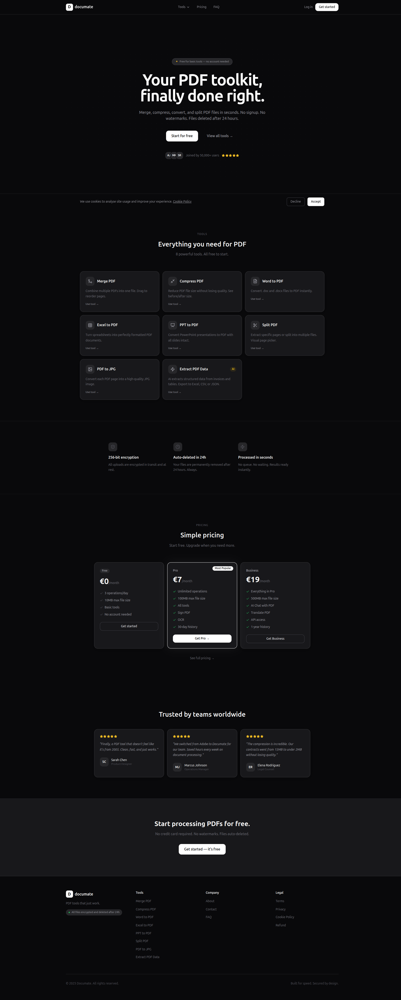
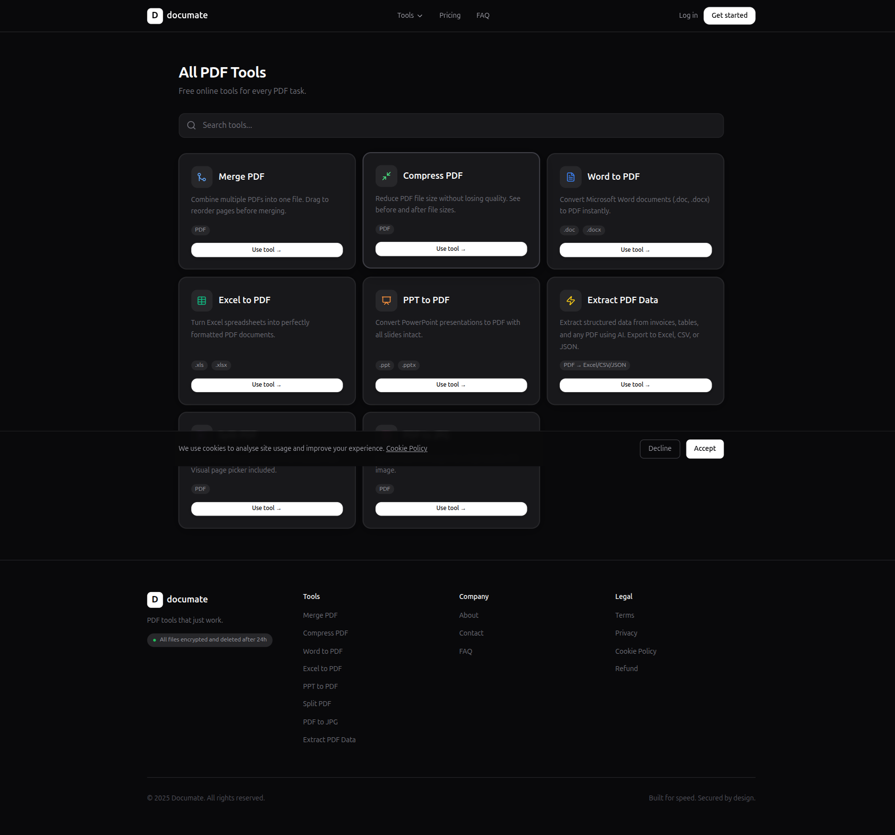
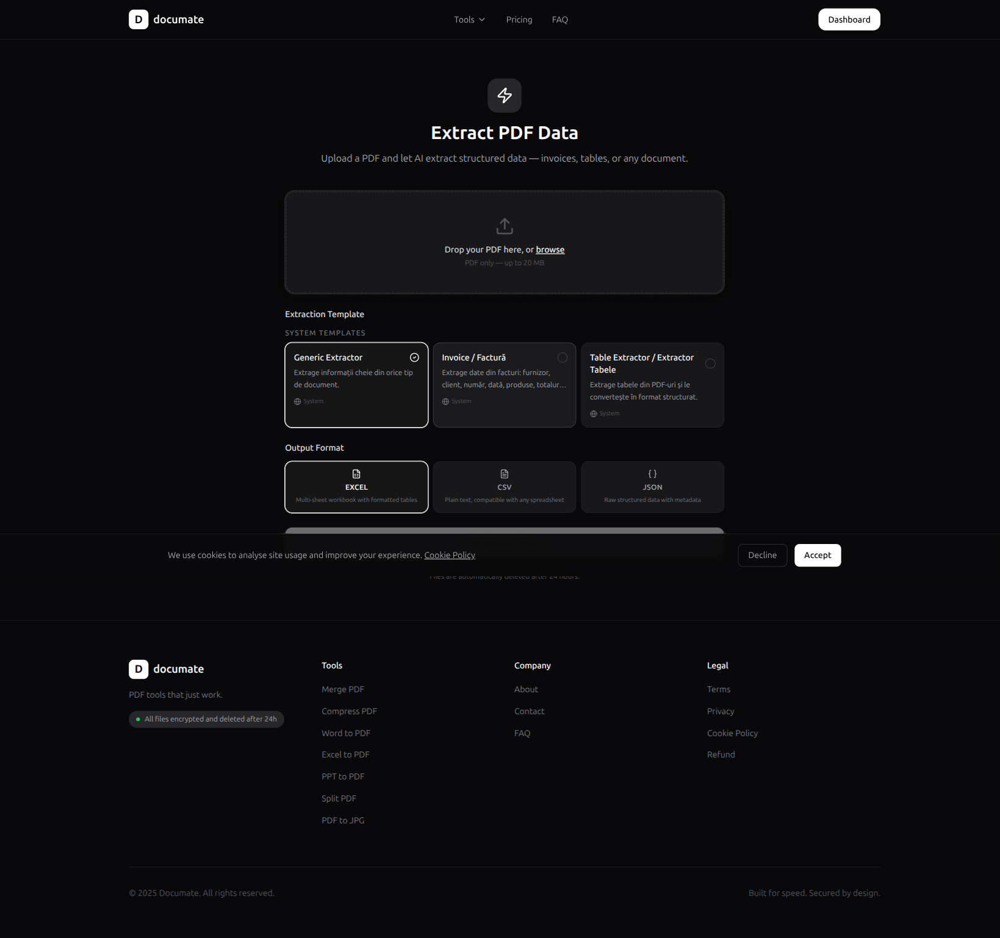
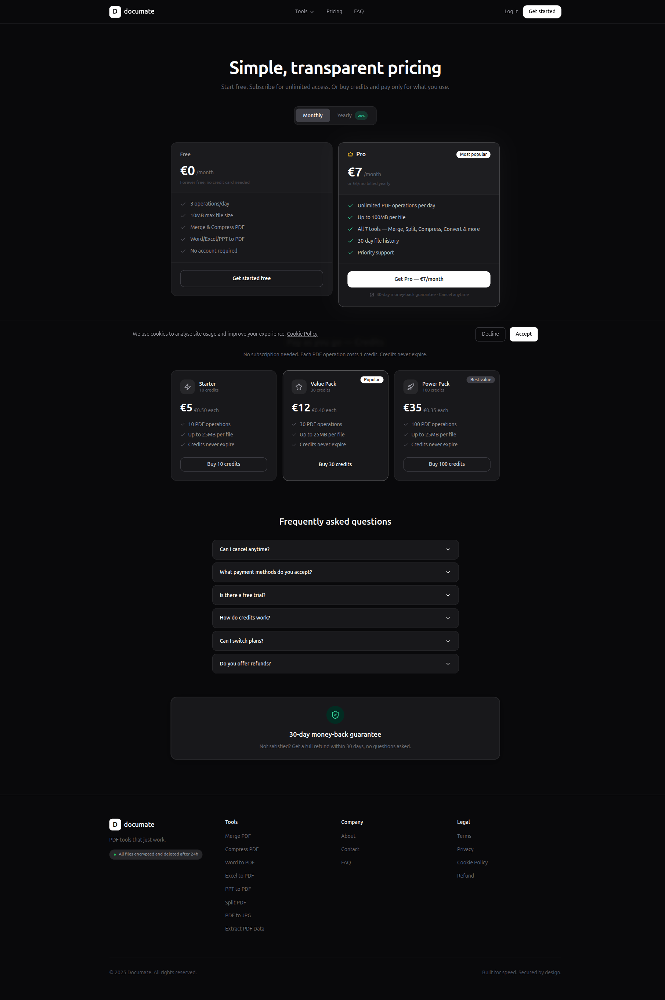

# Documate — PDF Tools SaaS

> **Your PDF toolkit, finally done right.**
> Merge, compress, convert, and split PDF files in seconds. No signup required for basic tools. Files deleted after 24 hours.

**Built solo — from product design to self-hosted production deployment.**

[](https://php.net)
[](https://laravel.com)
[](https://react.dev)
[](https://www.typescriptlang.org)
[](LICENSE)

---



---

## What Is This

Documate is a production SaaS application for processing PDF files — built entirely by one developer, shipped and self-hosted. It covers the full lifecycle of a SaaS product: user auth, subscription billing, async job processing, AI integration, and cloud deployment.

The project demonstrates end-to-end ownership across the stack: Laravel backend, React + TypeScript frontend, Stripe billing, queued PDF jobs via Ghostscript/ImageMagick, and an AI-powered data extraction engine that supports multiple LLM providers.

---

## Tools



| Tool | Description | Formats |
|------|-------------|---------|
| **Merge PDF** | Combine multiple PDFs into one, drag to reorder pages | PDF → PDF |
| **Compress PDF** | Reduce file size with before/after size comparison | PDF → PDF |
| **Split PDF** | Extract specific pages or split into individual files | PDF → PDF |
| **Word to PDF** | Convert Word documents with full formatting preserved | .doc, .docx → PDF |
| **Excel to PDF** | Turn spreadsheets into perfectly formatted PDF documents | .xls, .xlsx → PDF |
| **PPT to PDF** | Convert presentations with all slides intact | .ppt, .pptx → PDF |
| **PDF to JPG** | Export each page as a high-quality image | PDF → JPG |
| **Extract PDF Data** | AI-powered structured data extraction — export to Excel, CSV, or JSON | PDF → Excel / CSV / JSON |

All tools are available to guests (no account required). Authenticated users get higher daily limits and file history.

---

## AI-Powered Data Extraction



The extraction tool lets users upload any PDF and extract structured data using AI. It ships with system templates (Generic, Invoice, Table Extractor) and supports user-defined custom templates saved per account.

**Output formats:** Excel (multi-sheet), CSV, JSON

**Supported AI providers** — switchable via config:
- Claude (Anthropic)
- Gemini (Google)
- OpenAI (GPT-4o)
- Ollama (self-hosted, local models)

The `AiProviderFactory` resolves the configured provider at runtime, making it trivial to swap models or add new ones.

---

## Pricing & Billing



Billing is handled via **Stripe Checkout** and **Laravel Cashier**.

**Subscription plans:**
| Plan | Price | Operations/day | File size |
|------|-------|---------------|-----------|
| Free | €0 | 3 | 10 MB |
| Pro | €7/mo | Unlimited | 100 MB |
| Business | €19/mo | Unlimited | 100 MB + API access |

**One-time credit packs** (no subscription required):
| Pack | Price | Credits |
|------|-------|---------|
| Starter | €5 | 10 ops |
| Value Pack | €12 | 30 ops |
| Power Pack | €35 | 100 ops |

Usage limits are enforced at the controller level before dispatching any job. Stripe webhooks handle subscription lifecycle events (created, updated, cancelled).

---

## Architecture

### No Separate REST API

The app uses **Inertia.js** as the bridge between Laravel and React. Controllers return `Inertia::render('PageName', $data)` — no REST API, no separate frontend server. Data flows from the server directly into React props. `axios` is used only for lightweight JSON polling endpoints.

### PDF Job Lifecycle

```
User uploads file
    → Controller validates + stores temp file → creates UserFile record
    → Dispatches queued Job (e.g. MergePdfJob)
    → Redirects to /status/{uuid}

Status page polls GET /status/{uuid}/poll every 2s (JSON)
    → Job runs Ghostscript / ImageMagick
    → Updates UserFile status: pending → processing → completed / failed

On completion → user downloads via GET /tools/download/{uuid}
Files auto-expire and are deleted after 24 hours.
```

### Guest Support

Basic tools work without an account. Guest sessions are tracked via a signed cookie (`guest_id`), allowing job ownership checks on status and download routes without requiring login.

### Key Models

| Model | Purpose |
|-------|---------|
| `User` | Auth, Cashier `Billable` trait, `currentPlanLimits()`, `todayUsage()` |
| `UserFile` | Every file operation — status, paths, expiry, operation type |
| `DailyUsage` | Per-user daily counters for free-tier enforcement |
| `ExtractionTemplate` | System and user-defined templates for AI extraction |

---

## Tech Stack

| Layer | Technology |
|-------|-----------|
| **Backend** | Laravel 13, PHP 8.3 |
| **Frontend** | React 18, TypeScript, Vite 8 |
| **Styling** | Tailwind CSS 3.4, shadcn/ui (Radix UI) |
| **SPA Bridge** | Inertia.js |
| **Billing** | Laravel Cashier + Stripe |
| **PDF Processing** | Ghostscript, ImageMagick, Poppler |
| **AI Extraction** | Claude, Gemini, OpenAI, Ollama |
| **Queue** | Laravel Queue (database driver) |
| **Database** | MySQL 8.0 |
| **Email** | Brevo (SMTP) |
| **Error Tracking** | Sentry |
| **Deployment** | Coolify, Traefik, Docker |

---

## Local Development

### Prerequisites

- Docker + Docker Compose
- Add `documate.test` to `/etc/hosts` → `127.0.0.1`
- Copy `.env.example` to `.env` and fill in the required keys (Stripe, AI provider, DB)

### Start the stack

```bash
# From the repo root (where docker-compose.yml lives)
docker-compose up
```

This starts:
- **PHP/Apache** on port `8083` (proxied via Traefik to `documate.test`)
- **MySQL 8.0** on port `3310`
- **Vite HMR** on port `5174`

### Install & run

```bash
composer install
npm install

php artisan migrate

# Start Laravel + queue worker + Vite concurrently
composer run dev
```

### Useful commands

```bash
# All PHPUnit tests
composer run test

# Single test class
php artisan test --filter=ClassName

# Queue worker
php artisan queue:work

# Fresh DB with seed data
php artisan migrate:fresh --seed

# Production build
npm run build
```

---

## Project Structure

```
documate/
├── app/
│   ├── Http/Controllers/
│   │   ├── Tools/              # MergePdf, CompressPdf, SplitPdf, OfficeToPdf, PdfToJpg
│   │   ├── Extraction/         # AI extraction controller + template CRUD
│   │   ├── Credits/            # One-time credit pack checkout
│   │   └── SubscriptionController.php
│   ├── Jobs/                   # MergePdfJob, CompressPdfJob, SplitPdfJob, ...
│   ├── Models/                 # User, UserFile, DailyUsage, ExtractionTemplate
│   └── Services/
│       ├── Ai/                 # AiProviderFactory + Claude/Gemini/OpenAI/Ollama providers
│       ├── Pdf/                # PDF processing services
│       └── Subscription/       # Plan limits, billing logic
├── resources/js/
│   ├── Pages/
│   │   ├── tools/              # merge-pdf, compress-pdf, split-pdf, extract-pdf, ...
│   │   └── dashboard/          # usage stats, file history, billing, settings
│   └── components/
│       ├── ui/                 # shadcn/ui primitives
│       └── documate/           # App-specific components
├── routes/web.php
└── screenshots/                # README assets
```

---

## Deployment

The production instance runs on a **DigitalOcean VPS** managed by **Coolify**, with **Traefik** as the reverse proxy (HTTPS termination, routing).

- Zero-downtime deploys via Coolify's rolling deployment
- Full environment isolation (separate containers per service)
- Transactional email via **Brevo SMTP**
- Error tracking and alerting via **Sentry**

---

## About

Built by **Constantin Paduraru** — Full-Stack Developer (Laravel · React · TypeScript).

- GitHub: [github.com/paduCosty](https://github.com/paduCosty)
- LinkedIn: [linkedin.com/in/constantin-paduraru](https://linkedin.com/in/constantin-paduraru)
- Email: padu.costi7@gmail.com

---

## License

MIT
